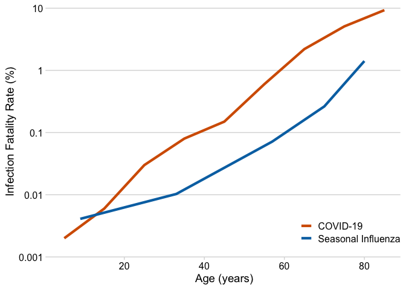
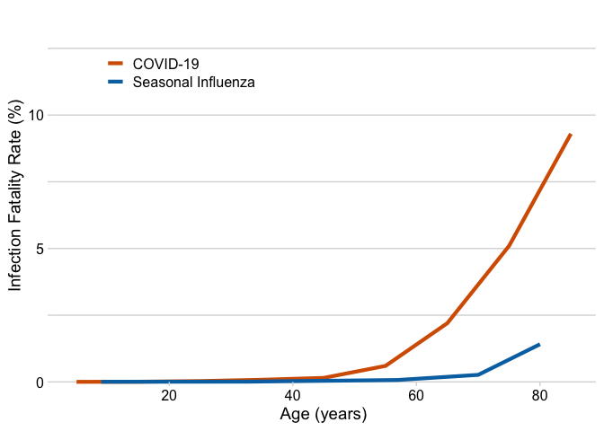

<!-- README.md is generated from README.Rmd. Please edit that file -->

# COVID-19 Infection Fatality Rates

Claus O. Wilke, March 17, 2020

To see the code that produced this document, please click
[here.](https://github.com/clauswilke/COVID19-IFR/blob/master/README.Rmd)

Seasonal influenza fatality rates (from 1997 to 2007) were estimated by
[Jesse
Bloom.](https://github.com/jbloom/CoV_vs_flu_CFR/blob/master/cfr_stats.ipynb)
He took all-cause influenza-associated mortality rates from Table 1 of
[Quandelacy et al.
(2014)](https://www.ncbi.nlm.nih.gov/pmc/articles/PMC3873104/) and
assumed a 10% incidence rate in the
population.

<table class="table table-striped table-hover" style="margin-left: auto; margin-right: auto;">

<thead>

<tr>

<th style="text-align:left;">

label

</th>

<th style="text-align:right;">

age

</th>

<th style="text-align:right;">

IFR

</th>

<th style="text-align:left;">

disease

</th>

</tr>

</thead>

<tbody>

<tr>

<td style="text-align:left;">

\<18

</td>

<td style="text-align:right;">

9

</td>

<td style="text-align:right;">

0.0041

</td>

<td style="text-align:left;">

Seasonal Influenza

</td>

</tr>

<tr>

<td style="text-align:left;">

18-49

</td>

<td style="text-align:right;">

33

</td>

<td style="text-align:right;">

0.0103

</td>

<td style="text-align:left;">

Seasonal Influenza

</td>

</tr>

<tr>

<td style="text-align:left;">

50-64

</td>

<td style="text-align:right;">

57

</td>

<td style="text-align:right;">

0.0718

</td>

<td style="text-align:left;">

Seasonal Influenza

</td>

</tr>

<tr>

<td style="text-align:left;">

65-74

</td>

<td style="text-align:right;">

70

</td>

<td style="text-align:right;">

0.2637

</td>

<td style="text-align:left;">

Seasonal Influenza

</td>

</tr>

<tr>

<td style="text-align:left;">

\>=75

</td>

<td style="text-align:right;">

80

</td>

<td style="text-align:right;">

1.4115

</td>

<td style="text-align:left;">

Seasonal Influenza

</td>

</tr>

</tbody>

</table>

COVID-19 fatality rate data are taken from Table 1 from [Ferguson et al.
(2020).](https://www.imperial.ac.uk/media/imperial-college/medicine/sph/ide/gida-fellowships/Imperial-College-COVID19-NPI-modelling-16-03-2020.pdf)
Importantly, these rates are corrected for infections that remain
undetected (i.e., do not become cases). Actual case fatality rates are
approximately a factor of 2 higher, see [Verity et al.
(2020),](https://www.medrxiv.org/content/10.1101/2020.03.09.20033357v1)
Table
1.

<table class="table table-striped table-hover" style="margin-left: auto; margin-right: auto;">

<thead>

<tr>

<th style="text-align:left;">

label

</th>

<th style="text-align:right;">

age

</th>

<th style="text-align:right;">

IFR

</th>

<th style="text-align:left;">

disease

</th>

</tr>

</thead>

<tbody>

<tr>

<td style="text-align:left;">

0-9

</td>

<td style="text-align:right;">

5

</td>

<td style="text-align:right;">

0.002

</td>

<td style="text-align:left;">

COVID-19

</td>

</tr>

<tr>

<td style="text-align:left;">

10-19

</td>

<td style="text-align:right;">

15

</td>

<td style="text-align:right;">

0.006

</td>

<td style="text-align:left;">

COVID-19

</td>

</tr>

<tr>

<td style="text-align:left;">

20-29

</td>

<td style="text-align:right;">

25

</td>

<td style="text-align:right;">

0.030

</td>

<td style="text-align:left;">

COVID-19

</td>

</tr>

<tr>

<td style="text-align:left;">

30-39

</td>

<td style="text-align:right;">

35

</td>

<td style="text-align:right;">

0.080

</td>

<td style="text-align:left;">

COVID-19

</td>

</tr>

<tr>

<td style="text-align:left;">

40-49

</td>

<td style="text-align:right;">

45

</td>

<td style="text-align:right;">

0.150

</td>

<td style="text-align:left;">

COVID-19

</td>

</tr>

<tr>

<td style="text-align:left;">

50-59

</td>

<td style="text-align:right;">

55

</td>

<td style="text-align:right;">

0.600

</td>

<td style="text-align:left;">

COVID-19

</td>

</tr>

<tr>

<td style="text-align:left;">

60-69

</td>

<td style="text-align:right;">

65

</td>

<td style="text-align:right;">

2.200

</td>

<td style="text-align:left;">

COVID-19

</td>

</tr>

<tr>

<td style="text-align:left;">

70-79

</td>

<td style="text-align:right;">

75

</td>

<td style="text-align:right;">

5.100

</td>

<td style="text-align:left;">

COVID-19

</td>

</tr>

<tr>

<td style="text-align:left;">

\>=80

</td>

<td style="text-align:right;">

85

</td>

<td style="text-align:right;">

9.300

</td>

<td style="text-align:left;">

COVID-19

</td>

</tr>

</tbody>

</table>

We now combine these two datasets and plot them. We use a log scale for
the y axis because it will show a uniform increase in risk as a shift of
one curve relative to the other.

<!-- -->

We see that indeed the COVID-19 curve is systematically shifted relative
to the seasonal influenza curve, by approximately a factor of 5-10. (The
fatality rate estimates are too imprecise to try to quantify this more
accurately from this type of a crude analysis.)

For comparison, we can also use a linear scale for the y axis. This
representation emphasizes the high risk that COVID-19 poses for the
elderly, but it hides the fact that for younger people COVID-19 is also
much more risky than the seasonal influenza.

<!-- -->
